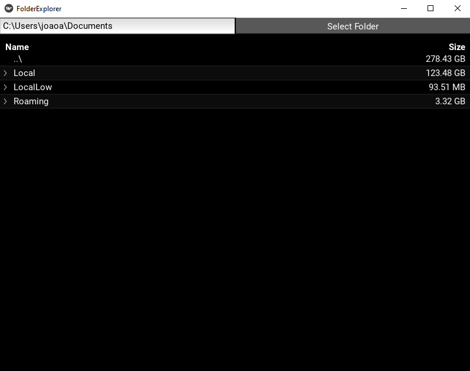

# Folder Explorer

Recently my computer ran out of space and I had to delete a lot of files. I was looking for a way to find big files that I did not care for them anymore, unfortunately, it's hard to look at file sizes manually. So I decided to write a program that does this for me.

The program is something I wrote in my free time, it's not perfect. I'm not the most expert in Kinvy, so right now the program will freeze for a long time until it's done computing the folder sizes, but it does the job and I'm happy with it. I'm sharing it in case someone else finds it useful.

## How to use

1. You can check the conda environment file to see the dependencies in the `environment.yml` file. To create the environment, run `conda env create -f environment.yml`.

2. Run the program with `python main.py`.