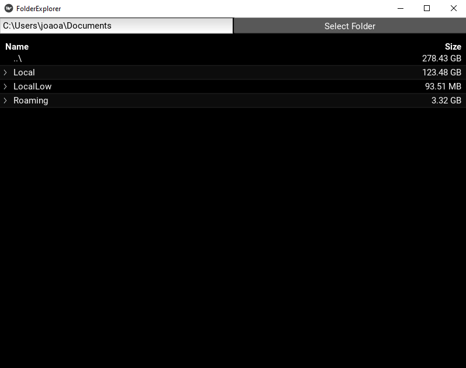

# Folder Explorer

Recently my computer ran out of space and I had to delete a lot of files. I was looking for a way to find big files that I did not care for them anymore, unfortunately, it's hard to look at file sizes manually. So I decided to write a program that does this for me.

The program is something I wrote in my free time, it's not perfect. Folder sizes are computed concurrently in a background thread pool, so the UI stays responsive while sizes load in.

## Features

- Browse folders and see their sizes computed in the background
- Sort entries by name or by size
- Refresh to recompute sizes
- Shows hidden and system files
- Skips symlinks and junction points to avoid double-counting

## How to use

1. Install dependencies with `uv sync`.

2. Run the program with `uv run main.py`.
